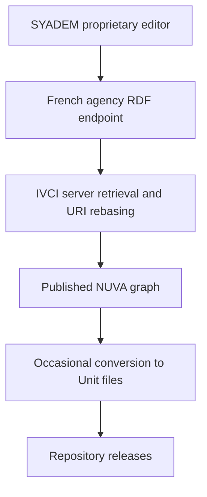
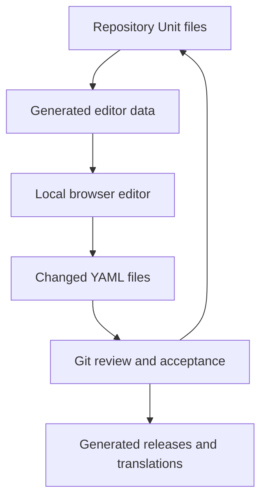

# François Kaag’s NUVA Editing Environment

## Review and starting point for collaboration

**Prepared:** 17 September 2026  
**Reviewed sources:** François’s emails, his draft presentation dated 14 October 2026, the NUVA editor, and the `IVC-NUVA/NUVA` repository at commit `4a40a49` (16 September 2026).

## Executive summary

François has created a lightweight, browser-based working environment for maintaining NUVA vaccines and valences and for analyzing mappings between NUVA and external vaccine code systems. It uses plain HTML, CSS, and JavaScript, has no third-party browser dependencies, and runs from the repository’s `docs` directory or through GitHub Pages at [nuva.ivci.org](https://nuva.ivci.org).

The work is more important than a new viewer. It is the beginning of a transition from a publication process centered on SYADEM’s proprietary terminology tooling to a community-maintainable, Git-based process in which:

1. YAML “Unit” files become the authoritative source for individual NUVA concepts.
2. Contributors use a local browser editor to review or change vaccines and valences.
3. The editor exports only the changed Unit files.
4. Git records the history of every concept and supports review of proposed changes.
5. Repository automation rebuilds the web data, translations source, RDF, CSV, alignment products, and releases.

François has implemented much of the local editing and mapping experience. The contribution, review, validation, and release workflow remains partly designed rather than fully implemented. This distinction matters: the current work should be treated as a strong prototype and architectural transition, not yet as a production editorial system.

## What François has created

### 1. A static NUVA browser and editor

The editor exposes four functional areas:

- **Vaccines:** Browse abstract and real vaccine concepts, filter by valence or brand name, create concepts, edit labels and comments, associate a real vaccine with an abstract vaccine, assign valences to abstract vaccines, and mark vaccines deprecated.
- **Valences:** Browse the valence hierarchy, expand or collapse branches, select valences, create or edit valences, assign a parent, and record a valence technology type.
- **File tools:** Save the current browser state as JSON, restore a saved state, discard changes, and download YAML Unit files for concepts changed during the session.
- **Code-system tools:** Load direct mappings from an external code system to NUVA, calculate a reverse NUVA-to-external map, report mapping metrics, and combine mappings to produce a transcription map between two external code systems.

The editor emphasizes safe experimentation. Changes remain in the browser until the user explicitly downloads files. Using the editor alone cannot alter the published NUVA repository.

### 2. A useful interaction model for valences and vaccines

François has implemented a shared valence selection mechanism across the vaccine and valence views. A selected valence can be used to:

- assign valences to an abstract vaccine;
- assign a parent to a valence;
- filter the valence tree to related ancestors and descendants; and
- filter vaccines to concepts containing the selected valences or their descendants.

The model recognizes that a user often moves between two representations of the same semantic problem: the valence hierarchy and the vaccine concepts that use those valences.

The editor also enforces or detects several constraints, including:

- the expected `VAC####` and `VAL###` identifier patterns;
- uniqueness of identifiers;
- uniqueness of active abstract vaccines for a valence combination;
- compatibility between a valence’s technology type and its position in the hierarchy;
- references to existing valences and abstract vaccines; and
- handling of deprecated concepts.

These checks are valuable, but they do not yet constitute a complete validation suite for all NUVA editorial rules.

### 3. Unit-file generation and local recovery

The repository stores each vaccine, valence, disease target, and code system as an individual YAML Unit file. This provides concept-level Git history and makes proposed changes reviewable without comparing a single large graph.

The editor can generate Unit files for modified vaccines and valences. It also lets a contributor download a dated JSON snapshot and restore it later. Browser persistence behaves differently by mode:

- the hosted editor uses persistent local browser storage;
- a page opened with `file://` uses session storage; and
- a downloaded JSON backup provides explicit recovery and transfer between sessions.

### 4. External code-system analysis

The code-system tool starts with a direct CSV map from an external code system to NUVA. For example, `CVX2nuva.csv` assigns each CVX concept to its closest NUVA vaccine concept.

From that direct map, the tool calculates a reverse map for every NUVA vaccine. The reverse calculation considers:

- exact mappings to real or abstract vaccines;
- broader abstract vaccines that can represent a more specific NUVA concept;
- the best available external code;
- **blur**, or how many NUVA concepts share that broader representation; and
- **equivalence**, or how many external codes map exactly to the same NUVA concept.

This turns NUVA into a semantic pivot rather than a simple crosswalk table. A second direct map can be combined with the first result to generate a transcription map between external systems, such as CVC to CVX.

The mapping tool also accepts CSV files that contain pending rows whose NUVA value does not match the `VAC####` pattern. Current code ignores those rows during computation rather than failing the entire import. The source CSV can therefore retain visible mapping work in progress, although the present metrics do not appear to count those ignored rows as an explicit “unmapped” category.

### 5. Repository automation and generated products

François has connected the editor to repository automation:

- changes under `Units/` trigger regeneration of the JSON file used by the public editor;
- the same generation step updates the English source used by Weblate;
- a separate workflow generates RDF, CSV, language graphs, alignment outputs, and repository releases; and
- Weblate remains the intended environment for community translation work.

At the reviewed commit, the editor data represented 1,467 vaccine concepts, including 411 abstract and 1,056 real vaccines, plus 446 actual valence concepts. The repository contained 65 target concepts and 26 code-system definitions. These counts describe the reviewed snapshot and will change.

## The architectural transition

### Earlier publication path

This path made SYADEM’s internal resource management system the practical source of changes. Unit files were downstream products reconstructed from RDF.

### Intended community path

In the intended path, Unit files become the authoritative source. RDF, CSV, language graphs, reverse maps, metrics, and the public editor’s data become generated products. This inversion is the central architectural contribution.

## What exists now and what remains incomplete

| Area | Current state | Important boundary |
|---|---|---|
| Vaccine and valence browsing | Implemented | Publicly usable and backed by generated repository data |
| Local editing | Implemented | Changes stay in browser storage until downloaded |
| Creation and deprecation | Implemented in the UI | Requires editorial review before repository acceptance |
| Unit-file export | Implemented for changed vaccines and valences | Export is a download, not a direct Git submission |
| Consistency checks | Partly implemented | Does not yet cover all editorial and release invariants |
| Direct and reverse mappings | Implemented in browser | Needs stronger input validation, test cases, and documented formulas |
| Cross-system transcription | Implemented | Output quality depends entirely on the two source alignments and NUVA modeling |
| Translations | Weblate integration exists | Separate workflow from core concept editing |
| Git contribution workflow | Concept described | Contributor onboarding, branches, pull requests, approvals, and conflict handling need definition |
| Authenticated roles | Described in `Processes.md` | The current static editor has no authentication or authorization layer |
| Governed release process | Detailed in draft repository documentation | Tool enforcement and operational ownership are not yet complete |
| Alignment sources as standalone CSV | Direction established | The repository still contains transitional assumptions from alignments embedded in vaccine Units |

## Important observations and unresolved questions

### The current tool no longer needs Flask for its main functions

François’s earliest email anticipated a Python/Flask server because JavaScript could not write directly to the local file system. The implemented solution avoids that requirement by using browser file upload and download APIs. The normal workflow is now static and serverless.

However, “runs locally” and “works offline” are not yet the same claim. The reviewed JavaScript loads its default data from an absolute `https://nuva.ivci.org/data/nuvadata.json` URL even when the HTML files are opened locally. A local copy of `docs` therefore still depends on the hosted data unless this behavior changes.

### The repository is in an active schema transition

The recent history shows rapid changes to the vaccine representation, valence technology types, generated editor data, Weblate inputs, and automatic regeneration. Some documentation and generation code still reflect different stages of that transition.

One especially important seam is alignment ownership. François’s stated direction is to maintain external mappings as standalone CSV files owned by code-system experts. Some existing release-generation logic still reads external codes embedded in vaccine Unit files. The new vaccine Unit structure and editor export focus on `instanceOf` for real vaccines and valences for abstract vaccines. This boundary should be reconciled before the workflow becomes authoritative.

### The presentation includes both delivered functions and future operating policy

The presentation accurately demonstrates the current editor, but its final call to “organize the workflow” is significant. The repository’s process documentation goes further by describing a core team, scientific and ethical committee, contributor authorization, a one-week review period, emergency releases, and incident management. Those are governance proposals or intended procedures. They should not be documented as established IVC operations until the group adopts them and assigns owners.

### Generated YAML needs round-trip protection

The browser currently constructs YAML as text. This deserves automated round-trip tests for punctuation, quotation marks, line breaks, Unicode, empty values, dates, and every supported concept type. A file that looks correct in the browser could otherwise lose information or fail later generation.

### Mapping metrics need formal definitions

The terms “best,” “blur,” “equivalence,” “completeness,” “precision,” and “redundancy” are central to the value of the mapping tool. The algorithms exist, but contributors need normative definitions and worked examples. These definitions should distinguish:

- an exact semantic equivalent;
- the best available broader code;
- multiple packaging or presentation codes for one vaccine;
- a deliberately unmapped source code;
- a mapping still under review; and
- a code outside NUVA’s scope.

## Where Nathan can add the most value

The highest-value contribution is not immediately adding more UI. François has already demonstrated the core interaction. The project now needs a second person to make the workflow understandable, testable, and governable.

### 1. Establish the authoritative data flow

Write and agree on one short architectural decision that identifies:

- which files are authoritative for vaccines, valences, targets, translations, and alignments;
- which files are generated and must never be edited directly;
- how concept changes and alignment changes differ;
- when the SYADEM import remains available and when it retires; and
- what constitutes a NUVA version or release.

This will resolve several transitional ambiguities in the current repository.

### 2. Exercise one complete contribution

Use a branch to make a small, real change through the editor and carry it through review, generation, and release preparation. Record every manual step and every failure. A single traced example will expose more than a general design discussion.

A good first test would include:

1. edit an existing abstract vaccine;
2. add or adjust a valence relationship;
3. download the resulting Unit files;
4. compare them with the originals;
5. run all generators and validations;
6. inspect RDF, CSV, editor data, and translation changes; and
7. prepare, review, and reject or accept the pull request without publishing an official release.

### 3. Build an executable validation contract

Convert the editorial rules into automated tests. Initial checks should cover identifiers, required fields, valid dates, reference integrity, cycles in the valence tree, valence-type compatibility, unique active abstract-valence combinations, unique external-code assignments, deprecation rules, and preservation of unrelated fields during an edit.

The validation command should run locally and in every pull request. The browser can reuse the same test cases where practical, but repository validation should remain authoritative.

### 4. Specify and test the alignment model

Your terminology and interoperability background fits the least-finished part of the work: defining alignment semantics and contributor responsibilities. Useful deliverables would be:

- a versioned CSV schema;
- controlled values for mapping status and relationship;
- examples for exact, broader, narrower, unresolved, and out-of-scope mappings;
- test fixtures for CVX and another national product code system;
- explicit metric formulas; and
- rules for provenance, review date, contributor, and source-system version.

### 5. Separate software maturity from terminology governance

Maintain two small backlogs:

- **Tool readiness:** tests, error handling, offline behavior, data migration, accessibility, documentation, and release automation.
- **Editorial governance:** contributor qualification, review authority, conflict resolution, emergency changes, release approval, and stewardship succession.

This prevents a technical feature from accidentally deciding a governance question, or a governance discussion from blocking safe engineering improvements.

### 6. Reduce dependence on one maintainer

François’s work is understandable but still concentrated in his knowledge. Pair with him to document:

- why the reverse-map algorithm behaves as it does;
- known edge cases;
- how the generated resources relate;
- how to recover from a failed generation or release;
- which repository documents describe current practice versus a proposed future state; and
- the smallest supported local development and test setup.

## Suggested first collaboration plan

### Session 1: Architecture walkthrough

Ask François to walk through one concept from Unit file to published outputs and one external code through direct map, reverse map, metrics, and transcription. Capture decisions and unresolved assumptions.

### Session 2: Paired contribution test

Make one controlled change on a branch using only the documented workflow. Do not optimize the UI during this exercise. The objective is to identify missing steps, lossy transformations, and unclear ownership.

### Session 3: Validation and governance backlog

Sort findings into:

- defects that can corrupt or omit data;
- missing automated checks;
- usability improvements;
- documentation gaps; and
- decisions for IVC governance.

Then agree on the smallest workflow that two maintainers can safely operate before inviting wider contribution.

## Bottom line

François has built the first credible community editing layer for NUVA and has demonstrated that the essential work can occur with a small, dependency-free browser application backed by Git. He has also implemented a distinctive semantic mapping capability that uses NUVA to evaluate and translate between external vaccine code systems.

The next milestone should not be described simply as “finish the editor.” It is to make the repository an authoritative and reproducible publishing system: clearly separate sources from generated products, prove lossless round trips, formalize mapping semantics, enforce validation in Git, and adopt a practical review and release process. That is the area where an additional technical and governance lead can add immediate value.

## Source links

- [NUVA editor](https://nuva.ivci.org)
- [NUVA repository](https://github.com/IVC-NUVA/NUVA)
- [Repository scripts](https://github.com/IVC-NUVA/NUVA/tree/main/.github/scripts)
- [Weblate NUVA project](https://hosted.weblate.org/projects/nuva/)

