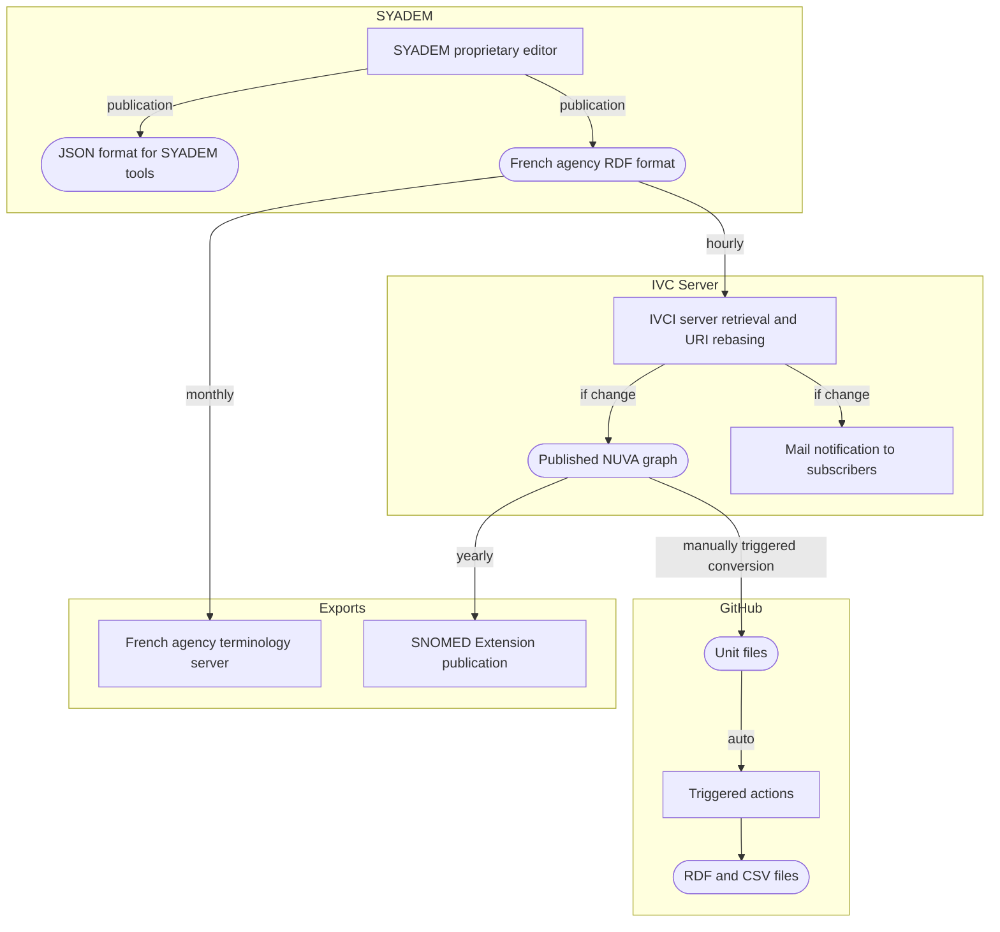
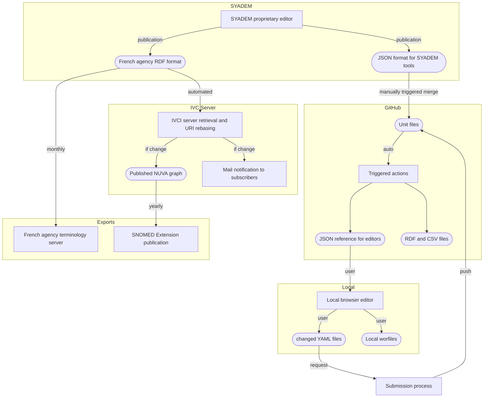
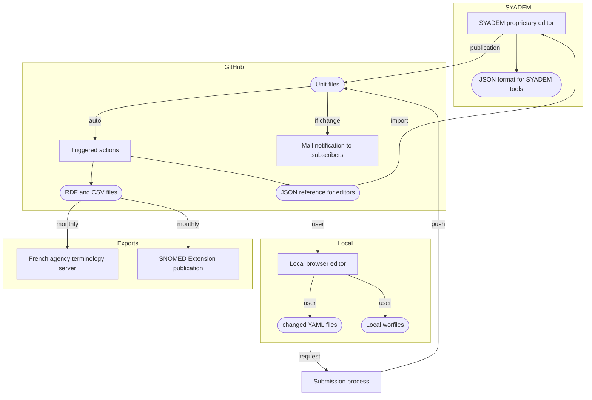

# Publication path #
### Earlier publication path

This path made SYADEM’s internal resource management system the practical source of changes. Unit files were downstream products reconstructed from RDF.

### Current publication path
  - Data is fetched from SYADEM using its internal publication format, and merged with the Unit files that contain new notions (such as the valence types).
  - Exports (French eHealth agency and SNOMED) and notifications not impacted yet.

### Target publication path
  - Unit files become authoritative for all users, including SYADEM.
  - The IVC server is removed from the publication path.
  - Exports and notifications are done from the GitHub publications.

