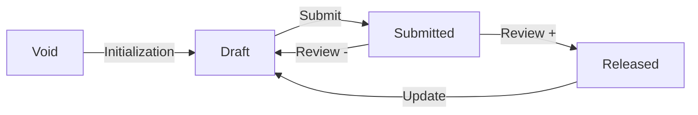

# Pages status
List of all pages with the status and the initials of the person assigned for next transition (from each page frontmatter).

<table>
<tr><th>Title</th><th>Status</th><th>Assignee</th></tr>


<tr><td><a href = '{{page.url}}' target = '_blank'>{{page.title}}</a></td>
<td>{{page.status}}</td>
<td>{{page.assignee}}</td></tr>


</table>

