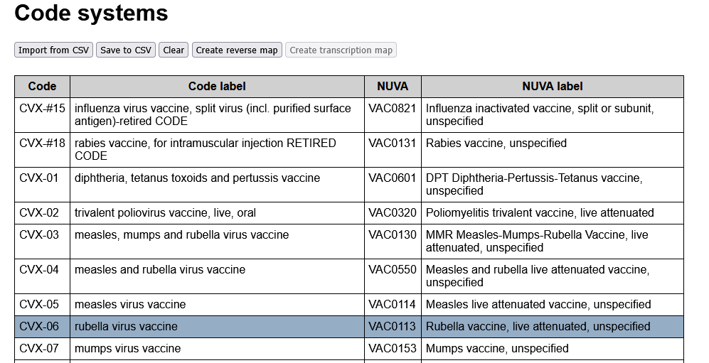
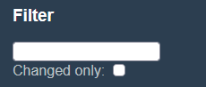
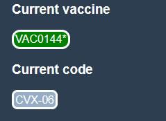
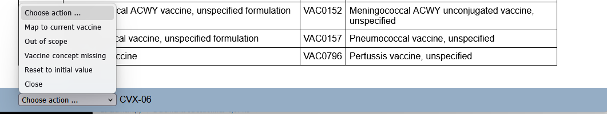

# Code Systems tab #
## Main view
The main view is originally empty. It is populated by importing an [alignment file](f_alignment.md). The codes, their labels, the associated NUVA codes are displayed as a codes table. The NUVA labels are fetched from the current workfile.

The action buttons are located at the top of the main view:
- `Import from CSV` will propose to select an [alignment file](f_alignment.md), then upload it to the browser.
- `Save to CSV` will save the current status of the codes table, after editing, or simply to include the NUVA labels if they were not in the initial submission.
- `Clear`resets to a void code table.
- `Create reverse map` is enabled if an [alignment file](f_alignment.md) has been loaded, and will create the corresponding [reverse map](f_rmap.md). 
- `Create transcription map` is enabled only if a reverse map has already been created. It will propose to select another [alignment file](f_alignment.md) and create the [transcription map](f_rmap.md) from the uploaded code system to the previously reversed one.

Clicking on any row in the codes table will open the edition zone at the bottom of the page.

## Sidebar
### Filter zone
The filter zone for codes consists of:
  - A text filter. Only codes having the entered text in their code, label, or the code or label of their NUVA equivalent, are presented.
  - A changed only filter. If checked, only codes that differ from the originally loaded [alignment file](f_alignment.md) are presented.

### Context zone
The context zone consists of:
  - `Current vaccine`: The currently edited vaccine
  - `Current code`: The currently edited external code

#### Current vaccine
See in [Vaccines tab](ed_vaccines.md) how it is set.

If set, selecting the menu item `Map to current vaccine` in the Edition zone will assign the selected code to this NUVA vaccine code.

#### Current code
Codes are selected for edition by clicking on a code row in the main view of the [Code Systems tab](ed_code.md).

Current code is the last code selected for edition. It is cleared if the menu item `Close` is used in the edition zone, or by clicking on the Code tag in the sidebar.

## Edition zone
All actions in the edition zone are selected within a single menu.

- `Map to current vaccine` will assign the given code to the current vaccine displayed in the sidebar.
- `Out of scope` is used for codes that do not belong to the scope of NUVA. The alignment value will be set to `#NA`.
- `Vaccine concept missing`means that the code is a legit concept for NUVA, but that one is missing. It is an indication for a future update once the NUVA code will have been created.
- `Reset to initial value` will restore the code to its NUVA equivalent in the initially uploaded [alignment file](f_alignment.md)
- `Close` will close the edition zone and clear the Current code in the sidebar.