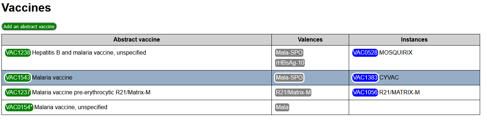
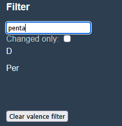
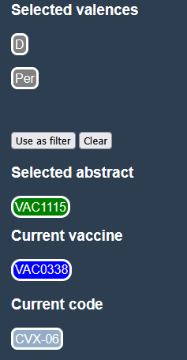
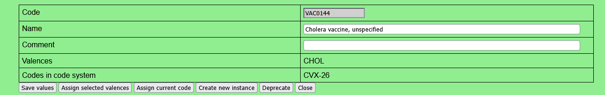
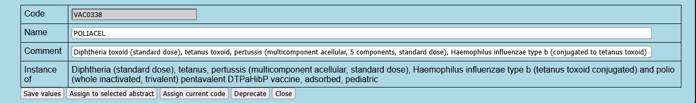

# Vaccines tab #
## Main view
The main view presents the list of abstract vaccines, their valences, and all the real vaccines that are instances of the given abstract vaccine.

It can be filtered according to the criteria set in the Filter zone on the sidebar.

Vaccines codes are presented with a vaccine tag, obeying the following conventions:
  - Abstract vaccines tags are green, real vaccines tags are blue, deprecated vaccines are light blue.
  - If a vaccine has an equivalent in the code system loaded in the [Code Systems tab](ed_codes.md), its code is marked with a trailing *.

Clicking on a vaccine tag opens the Edition zone for this vaccine.

At the top of the Main view, an action button `Add an abstract vaccine` allows to create a new entry in the list of abstract vaccines. Adding an instance to an existing abstract vaccine is done through the edition of the abstract vaccine.

## Sidebar
### Filter zone
The filter zone for vaccines consists of:
  - A text filter. Only vaccines having the entered text in their code or their description are presented.
  - A changed only filter. If checked, only vaccines that differ from the [reference workfile](f_workfile.md) are presented.
  - A valences filter. Only the vaccines presenting all of the valences in the filter are presented.

The valence filter is initialized by copying the selected valences from the Context zone to the filter (action button `Use as filter` in the Context zone). It can be cleared with the action button `Clear valence filter` in the Filter zone).
### Context zone
The context zone consists of:
  - `Selected valences`: The list of selected valences 
  - `Selected abstract`: The last edited abstract vaccine 
  - `Current vaccine`: The currently edited vaccine
  - `Current code`: The currently edited external code

  

#### Selected valences
This list is used:
  - To set the valences filter, with the action button `Use as filter`.
  - To set the valences for the currently edited abstract vaccine.

See in the [Valence tab](ed_valences.md) how it is set.

#### Selected abstract
The Selected abstract is used to change the abstract vaccine for a currently edited real vaccine.

Vaccines are selected for edition by clicking on a vaccine tag in the main view. If the selected vaccine is abstract, then it is are also set as the Selected abstract. Otherwise, the Selected abstract remains unchanged.

#### Current vaccine
Vaccines are selected for edition by clicking on a vaccine tag in the main view of this [Vaccines tab](ed_vaccines.md). 

Current vaccine is the last vaccine selected for edition. It is cleared if the action button `Close` is used in the Edition zone, or when a newly created vaccine is deleted by the `Reset to default` action.

#### Current code
See in the [Code systems tab](ed_codes.md) how it is set.

If it is set, the `Assign current code` action button is presented in the vaccines edition zone. When clicked the code is assigned (or reassigned) to the current vaccine.

## Edition zone
The aspect of the edition zone differs when the current vaccine is abstract or real. They do have anyhow common fields and action buttons

### Common fields and actions
If this is a vaccine creation, the vaccine code can be entered. Otherwise, it is only displayed.

The label and comment for the vaccine are text zones that can be modified.

The common action buttons are:
- `Save values` saves the entered code, label and comment.
- `Assign current code` is presented only if a Current code is set in the sidebar. When clicked it assigns or reassigns the current code to the current vaccine.
- `Deprecate` will flag the current vaccine code as deprecated.
- `Reset to default`, presented only for new or modified vaccines, will reset the vaccine to its reference values, or delete it if did not exist in the reference workfile.
- `Close` will close the edition zone and clear the Current vaccine in the sidebar.
### Specificities for an abstract vaccine
For an abstract vaccine, the background of the edition zone is green.
  

The list of valences is displayed, and can be modified with an action button.

The specific action buttons are:
- `Assign selected valences` replaces the current list of valences with the list of Selected valences in the sidebar.
- `Create new instance` will reopen the Edition zone for a newly created real vaccine, instance of the given abstract vaccine.

### Specificities for a real vaccine
For a real vaccine, the background of the edition zone is blue.
  

The only specific action button is `Assign to selected abstract`, that allows to change the real vaccine class to the Selected abstract presented in the sidebar.

