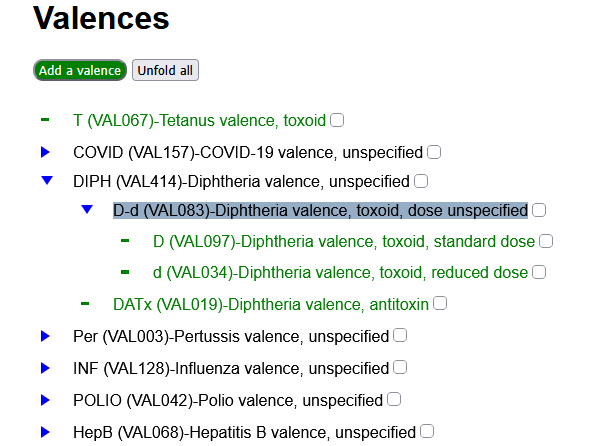
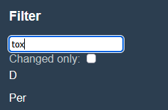
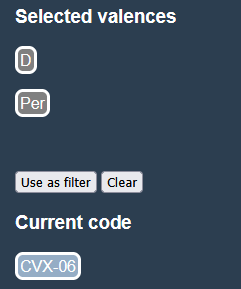
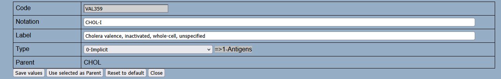

# Valences tab #
## Main view
The main view presents the tree of valences, sorted by decreasing frequency of use.

It can be filtered according to the criteria set in the Filter zone of the sidebar. If a valence is accepted by the filter, all its ascendants are presented too.

If a line in the list is clicked: 
- If the valence has descendants, they are unfolded or folded back.
-  the edition zone opens for the given valence.

An action button at the top of the view also allows to `Unfold all` or `Fold all` of the presented valences.

If the checkbox at the end of the line is checked, the valence is added to the Selected valences in the sidebar. If ascendants or descendants of this valence were present, they are removed from the selected valences.

To help in finding a selected valence when the tree is folded, greyed out checkboxes are presented for ascendants of selected valences.

At the top of the Main view, and action button `Add a valence` allows to create a new valence concept by opening the edition zone with an editable valence code.

## Sidebar
### Filter zone
The filter zone for valences consists of:
  - A text filter. Only valences having the entered text in their code, shorthand or description, as well as the ascendants of these valences, are presented.
  - A changed only filter. If checked, only valences that differ from the [reference workfile](f_workfile.md), and the ascendants of these valences are presented.
  - A valences filter. Only the valences in the filter and their ascendants are presented.

The valence filter is initialized by copying the selected valences from the Context zone to the filter (action button `Use as filter` in the Context zone). It can be cleared with the action button `Clear valence filter` in the Filter zone).
### Context zone
The context zone consists of:
  - `Selected valences`: The list of selected valences 
  - `Current code`: The currently edited external code

  
#### Selected valences
This list is used to set the valences filter, with the action button `Use as filter`. 

Its first item is used in the Edition zone to change the parent for a valence.

Valences are added to the selected valences:
  - In the [Vaccines tab](ed_vaccines.md) by clicking on a valence tag in the Valences column of the main view.
  - In the [Valences tab](ed_valences.md) by ticking a valence in the valences hierarchy of the main view.

They can be removed individually by clicking on the valence tag in the sidebar, or globally with the `Clear`action button.

#### Current code
See in the [Code systems tab](ed_codes.md) how it is set.

It has no role in this Valences tab, it is only a reminder during the [alignment process](../usage/aligning.md).

## Edition zone

In the edition zone, text fields allow to set the valence notation and label. The valence code is editable only in the case of a valence creation.

The [valence type](core/valence_types.md) are selectable in a list, restricted to be compatible of the valence types already set for ascendants or descendants of the given valence.

Action buttons:
- `Save values` saves the entered code, shorthand notation, label and valence type.
- `Use selected as parent` will take the first item in the Selected valences list as the new parent for the valence. If valence types are not compatible, the moved valence type is reassigned to `Implicit`.
- `Reset to default`, presented only for modified valences, will reset the valence to its reference values, or delete it if did not exist in the reference workfile.
- `Close` will close the edition zone.