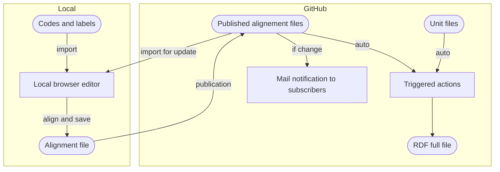

# Aligning a code system
## Workflow for alignments

```mermaid
flowchart TD
  subgraph GitHub
    GH1(["Unit files"])
	GH2(["Published alignement files"])
	GH3["Triggered actions"]
    GH5(["RDF full file"])
	GH6["Mail notification to subscribers"]	
  end
  subgraph Local
    LOC1(["Codes and labels"])
    LOC2["Local browser editor"]
	LOC3(["Alignment file"])
  end
    LOC1 -->|import| LOC2
    LOC2 -->|align and save| LOC3
	LOC3 -->|publication| GH2
	GH1 -->|auto| GH3
	GH2 -->|auto| GH3
	GH2 -->|if change| GH6
	GH3 --> GH5
	GH2 -->|import for update| LOC2
```