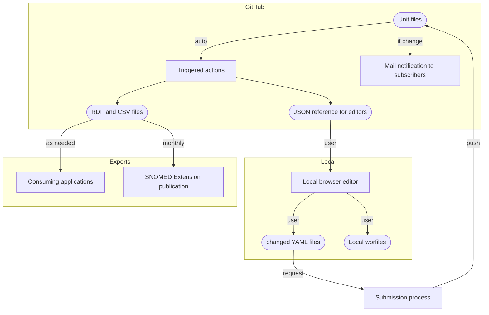

# Editing core concepts
## Workflow for core concepts

```mermaid
flowchart TD
  subgraph GitHub
    GH1(["Unit files"])
	GH2["Triggered actions"]
	GH3(["JSON reference for editors"])
    GH5(["RDF and CSV files"])
	GH6["Mail notification to subscribers"]	
  end
  subgraph Local
    LOC1["Local browser editor"]
	LOC2(["changed YAML files"])
	LOC3(["Local worfiles"])
  end
  subgraph Exports
    CONS["Consuming applications"]
	SCT["SNOMED Extension publication"]
  end   
	GH5 -->|as needed| CONS
	GH1 -->|if change| GH6
	GH5 -->|monthly| SCT
    GH1 -->|auto| GH2
	GH2 --> GH5
	GH2 --> GH3
    GH3 -->|user| LOC1
    LOC1 -->|user| LOC2
	LOC1 -->|user| LOC3
    LOC2 -->|request| GH4["Submission process"]
    GH4 -->|push| GH1
```