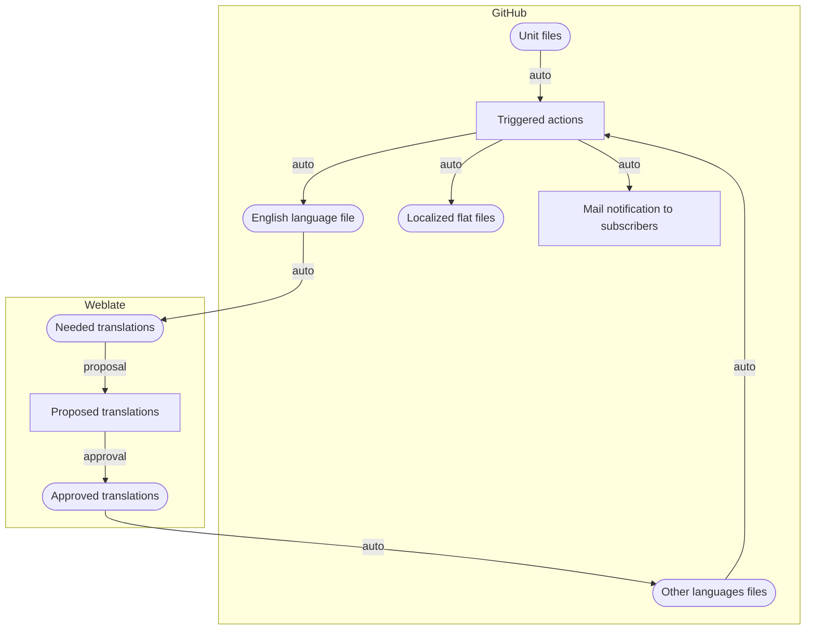

# Translating to another language
## Workflow for translations

```mermaid
flowchart TD
  subgraph GitHub
    GH1(["Unit files"])
	GH2["Triggered actions"]
	GH3(["English language file"])
    GH4(["Other languages files"])
    GH5(["Localized flat files"])
	GH6["Mail notification to subscribers"]	
  end
  subgraph Weblate
    WEB1(["Needed translations"])
    WEB2["Proposed translations"]
	WEB3(["Approved translations"])
  end
	GH1 -->|auto| GH2
	GH2 -->|auto| GH3
	GH3 -->|auto| WEB1
	WEB1 -->|proposal| WEB2
	WEB2 -->|approval| WEB3
	WEB3 -->|auto| GH4
	GH4 --> |auto| GH2
	GH2 --> |auto| GH5
	GH2 --> |auto| GH6
```